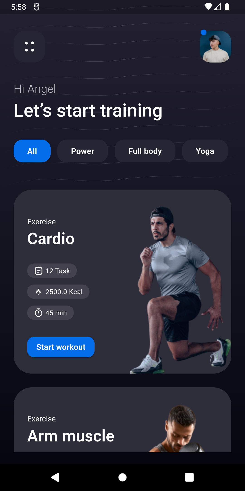

# Flutter UI Design Day 61-70

## Development Setup
Clone the repository and run the following commands:
```
flutter pub get
flutter run
```

# ScreenShot


## Day 61 - Birds App
 

## Day 62 - Rolex App
 
 

## Day 63 - Sport App
 

## Day 64 - Pizza App
  
<br>

## Day 65 - Properties for sale app
  
<br>

## Day 66 - Decoration app
 
<br>

## Day 67 - Apple Vision Pro
   
<br>

## Day 68 - Tennis Center
 
<br>

## Day 69 - Event App
 
<br>

## Day 70 - Meeting App
 
<br>